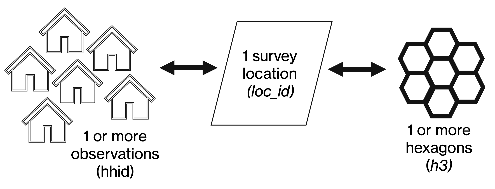

# Data for WISE-APP

This repository contains code used to pre-process microdata and hazard data for analysis in WISE-APP. WISE-APP connects to a data directory in local or remote file systems. The structure and the directory and data files is described below.

---

## Directory structure

```
data/
├── metadata/
│   ├── survey_list.csv
│   ├── variable_list.csv
│   └── cpi_ppp.csv
│
├── microdata/
│   ├── hh/
│   │   └── {code}/
│   ├── ind/
│   │   └── {code}/
│   ├── firm/
│   │   └── {code}/
│   └── h3/
│       └── {code}/
│
└── hazard/
    ├── weather/
    │   └── {code}/
    │       ├── observed/
    │       └── projections/
    └── events/
        └── {code}/
            ├── historical/
            └── probabilistic/
```

`{code}` is the ISO 3166-1 alpha-3 country code (e.g. `GNB`, `NGA`, `ETH`).

---

## Metadata

Three small CSV files loaded once when connected to the data directory. They drive UI filtering, variable labelling, and adjust monetary outcomes to make them comparable.

### `survey_list.csv`

One row per survey–level combination for which a microdata file exists.

| Column | Type | Description |
|--------|------|-------------|
| `economy` | string | Economy |
| `code` | string | Country code |
| `year` | integer | Starting year of survey |
| `survname` | string | Survey acronym (e.g. `EHCVM`, `LSMS`) |
| `level` | string | Unit of observation: `hh`, `ind`, or `firm` |
| `obs` | integer | Number of observations |
| `source` | string | Data source |

Example:

| economy | code | year | survname | level | obs | source |
|---------|------|------|----------|-------|-----|--------|
| Guinea-Bissau | GNB | 2018 | EHCVM | hh | 6420 | GMD |
| Guinea-Bissau | GNB | 2018 | EHCVM | ind | 31050 | GMD |

### `variable_list.csv`

One row per variable. Controls which variables appear in the UI, how they are labelled, and how they are used in the app for modelling.

| Column | Type | Description |
|--------|------|-------------|
| `name` | string | Variable name as it appears in the microdata |
| `label` | string | Human-readable label shown in the UI |
| `type` | string | R data type: `numeric`, `integer`, `logical` (0/1), `factor` (categorical), `character` (string), `Date` |
| `units` | string | Unit of measurement (e.g. `LCU/day`, `years`, `mm`) |
| `id` | binary | 1 if ID, date or other special variable (e.g. `hhid`, `int_month`, `weight`) |
| `outcome` | binary | 1 if outcome of interest |
| `hazard` | binary | 1 if hazard/weather variable |
| `ind` | binary | 1 if measured at individual level |
| `hh` | binary | 1 if measured at household level |
| `firm` | binary | 1 if measured at firm level |
| `area` | binary | 1 if measured at the area level |
| `interact` | binary | 1 if available as an interaction term in the model |
| `fe` | binary | 1 if available as a fixed effect in the model |

Example:

| name | label | type | units | id | outcome | weather | ind | hh | firm | area | interact | fe |
| --- | --- | --- | --- | --- | --- | --- | --- | --- | --- | --- | --- | --- |
| `code` | Country code | character |  | 1 | 0 | 0 | 0 | 0 | 0 | 0 | 0 | 1 |
| `economy` | Economy | character |  | 1 | 0 | 0 | 0 | 0 | 0 | 0 | 0 | 0 |
| `year `| Starting year of survey | integer |  | 1 | 0 | 0 | 0 | 0 | 0 | 0 | 0 | 1 |
| `survname` | Survey acronym | character |  | 1 | 0 | 0 | 0 | 0 | 0 | 0 | 0 | 0 |
| `loc_id` | Spatial unit ID | character |  | 1 | 0 | 0 | 0 | 0 | 0 | 0 | 0 | 1 |
| `h3` | H3 cell index | character |  | 1 | 0 | 0 | 0 | 0 | 0 | 0 | 0 | 0 |
| `hhid` | Household ID | character |  | 1 | 0 | 0 | 0 | 0 | 0 | 0 | 0 | 1 |
| `int_year `| Interview year | integer |  | 1 | 0 | 0 | 0 | 0 | 0 | 0 | 0 | 1 |
| `int_month` | Interview month | integer |  | 1 | 0 | 0 | 0 | 0 | 0 | 0 | 0 | 1 |
| `timestamp` | Date of weather | Date |  | 1 | 0 | 0 | 0 | 0 | 0 | 0 | 0 | 0 |
| `welfare `| Welfare per day | numeric | LCU | 0 | 1 | 0 | 0 | 1 | 0 | 0 | 1 | 0 |
| `age` | Age | numeric | years | 0 | 0 | 0 | 1 | 0 | 0 | 0 | 1 | 0 |
| `hhsize` | Household size | integer |  | 0 | 0 | 0 | 0 | 1 | 0 | 0 | 0 | 0 |
| `pop_2020` | Population in 2020 | numeric | people | 0 | 0 | 0 | 0 | 0 | 0 | 1 | 0 | 0 |
| `t` | Monthly temperature | numeric | °C | 0 | 0 | 1 | 0 | 0 | 0 | 0 | 0 | 0 |

The following must be included in the variable list and relevant data files:

- `code`, `economy`, `year`, `survname`, `int_year`, `int_month`, `loc_id`, `h3`, `timestamp`
- At least one *outcome* variable
- At least one *hazard* variable

### `cpi_ppp.csv`

One row per country–year–data level. Used to convert welfare aggregates from local currency units to comparable real values.

| Column | Type | Description |
|--------|------|-------------|
| `code` | string | Country code |
| `year` | integer | Starting year of survey |
| `data_level` | string | Geographic level of the price data (e.g. `national`, `urban`, `rural`) |
| `cpi` | numeric | Consumer price index |
| `ppp2021` | numeric | PPP conversion factor relative to 2021 USD |

Example:

| code | year | data_level | cpi | ppp2021 |
|------|------|------------|-----|---------|
| GNB | 2018 | national | 112.3 | 245.6 |
| GNB | 2021 | national | 131.7 | 268.4 |

---

## Microdata

All microdata files are parquet format. Files are named `{code}_{year}_{survname}_{level}.parquet` and stored under `microdata/{level}/{code}/`.

Examples:
```
microdata/hh/GNB/GNB_2018_EHCVM_hh.parquet
microdata/ind/GNB/GNB_2018_EHCVM_ind.parquet
microdata/firm/GNB/GNB_2018_EHCVM_firm.parquet
microdata/h3/GNB/GNB_2018_EHCVM_h3.parquet
```

### Individual file — `_ind.parquet`

One row per individual. Example:

| Column | Type | Description |
|--------|------|-------------|
| `code` | string | Country code |
| `economy` | string |  Economy |
| `year `| integer |  Starting year of survey |
| `survname` | string |  Survey acronym |
| `loc_id` |  string | Spatial unit ID |
| `hhid` |  string | Household ID |
| `pid` |  string | Individual ID |
| `int_year `| integer | Interview year |
| `int_month` | integer | Interview month |
| `weight` | numeric | Survey sampling weight |
| `wage` | numeric | Wage per day |
| `age` | integer | Age |
| `...` | | Additional variables per `variable_list.csv` |

### Household file — `_hh.parquet`

One row per household. Example:

| Column | Type | Description |
|--------|------|-------------|
| `code` | string | Country code |
| `economy` | string |  Economy |
| `year `| integer |  Starting year of survey |
| `survname` | string |  Survey acronym |
| `loc_id` |  string | Spatial unit ID |
| `hhid` |  string | Household ID |
| `int_year `| integer | Interview year |
| `int_month` | integer | Interview month |
| `weight` | numeric | Survey sampling weight |
| `welfare` | numeric | Welfare per day |
| `hhsize` | integer | Household size |
| `...` | | Additional variables per `variable_list.csv` |


### Firm file — `_firm.parquet`

One row per firm. Example:

| Column | Type | Description |
|--------|------|-------------|
| `code` | string | Country code |
| `economy` | string |  Economy |
| `year `| integer |  Starting year of survey |
| `survname` | string |  Survey acronym |
| `loc_id` |  string | Spatial unit ID |
| `fid` |  string | Firm ID |
| `int_year `| integer | Interview year |
| `int_month` | integer | Interview month |
| `weight` | numeric | Survey sampling weight |
| `revenue` | numeric | Revenue per day |
| `employees` | integer | Number of employees |
| `...` | | Additional variables per `variable_list.csv` |

Must be included in the ind/hh/firm microdata files:

- `code`, `economy`, `year`, `survname`, `int_year`, `int_month`, `loc_id`
- at least one *outcome* variable

### H3 lookup file — `_h3.parquet`

One row per H3 cell per location. This is the spatial bridge between microdata and all hazard data. It is shared across levels for the same survey — a single h3 file covers both `_hh.parquet` and `_ind.parquet` from the same survey.

| Column | Type | Description |
|--------|------|-------------|
| `code` | string | Country code |
| `year` | integer | Starting year of survey |
| `survname` | string | Survey acronym |
| `h3`$^1$ | string$^2$ | H3 cell index |
| `loc_id` | integer | Location identifier — join key to microdata files |
| `timestamp` | date | Interview date assigned to this cell (month precision) |
| `pop_2020` | integer | WorldPop 2020 population count — used for spatial weighting |
| `area_km2` | numeric | H3 cell area in km² |

$^1$ H3 cell index resolution is not fixed - merges are performed across resolutions using H3 parent/child relationships.
$^2$ H3 cell indices are stored as hexadecimal strings (e.g., "8928308280fffff") but 64-bit integers under the hood.

Must be included in the h3 microdata files:

- `code`, `year`, `survname`, `loc_id`, `h3`
- `pop_2020` is optional but used to weight hazard variables within locations when available

---

## Hazard data

All hazard files are parquet format, spatially indexed using H3 cells and temporally indexed at month resolution. The H3 index is the join key to the `_h3.parquet` lookup, which maps H3 cells to `loc_id` in the microdata.

### Weather

#### Observed — `hazard/weather/{code}/observed/`

One row per H3 cell per month. Covers the full historical record of the source dataset.

Filename: `{code}_{source}.parquet`

Examples:
```
hazard/weather/GNB/observed/GNB_era5land.parquet
hazard/weather/GNB/observed/GNB_chirps3.parquet
```

| Column | Type | Description |
|--------|------|-------------|
| `h3` | string | H3 cell index |
| `timestamp` | date | Month (first day of month) |
| `t` | numeric | Monthly temperature (°C) |
| `tx` | numeric | Monthly daily maximum temperature (°C) |
| `spei6` | numeric | Monthly Standardised Precipitation-Evapotranspiration Index (6-month accumulation) |
| `...` | | Additional weather variables |

#### Projected — `hazard/weather/{code}/projections/`

Same schema as observed. The baseline file covers the historical CMIP6 model simulation period (1950-2014) and is used as the reference for computing climate change deltas. SSP files cover future projection periods (2015-2100).

Filename: `{code}_{source}_{scenario}_{percentile}.parquet`

`{percentile}` represents the distribution of outcomes across the multi-model ensemble — different climate models produce a range of responses to the same greenhouse gas forcing.

Examples:
```
hazard/weather/GNB/projections/GNB_cmip6_baseline_p50.parquet
hazard/weather/GNB/projections/GNB_cmip6_ssp245_p50.parquet
hazard/weather/GNB/projections/GNB_cmip6_ssp370_p50.parquet
hazard/weather/GNB/projections/GNB_cmip6_ssp585_p50.parquet
hazard/weather/GNB/projections/GNB_cmip6_ssp585_p90.parquet
```
Must be included in weather data files:

- `h3`, `timestamp`
- at least one *hazard* variable

---

### Events 
🚧 **<span style="color:red">Under development. Not implemented in WISE-APP</span>**

#### Historical — `hazard/events/{code}/historical/`

One row per H3 cell per event. Covers recorded discrete hazard events (e.g. floods, tropical cyclones).

Filename: `{code}_{source}.parquet`

Examples:
```
hazard/events/GNB/historical/GNB_gfd.parquet
hazard/events/GNB/historical/GNB_ibtracs.parquet
```

| Column | Type | Description |
|--------|------|-------------|
| `h3` | string | H3 cell index |
| `event_id` | string | Unique event identifier |
| `event_type` | string | Hazard type (e.g. `flood`, `cyclone`, `drought`) |
| `date_start` | date | Event start date |
| `date_end` | date | Event end date |
| `duration_days` | integer | Event duration in days |
| `intensity` | numeric | Primary intensity measure (units vary by hazard type) |
| `...` | | Additional event-level variables |

#### Probabilistic — `hazard/events/{code}/probabilistic/`

One row per H3 cell per return period. Represents synthetic hazard footprints across a range of return periods. There is no timestamp — the join to microdata is spatial only, via `loc_id` through the h3 lookup. A single file contains all return periods for a given source and scenario.

Filename: `{code}_{source}.parquet` or `{code}_{source}_{scenario}_{percentile}.parquet` for climate-adjusted versions.

`{percentile}` is only relevant for multi-model ensemble outputs.

Examples:
```
hazard/events/GNB/probabilistic/GNB_fathom.parquet
hazard/events/GNB/probabilistic/GNB_storm_ssp585_p50.parquet
```

| Column | Type | Description |
|--------|------|-------------|
| `h3` | string | H3 cell index |
| `event_type` | string | Hazard type (e.g. `flood`, `cyclone`) |
| `return_period` | integer | Return period in years (e.g. 10, 50, 100) |
| `intensity` | numeric | Primary intensity measure (units vary by hazard type) |
| `...` | | Additional scenario-level variables |


## Preparing data for WISE-APP

### 1. Define variables

Define the variables derived from microdata and weather data in `variable_list.csv`. Each row documents a variable, its meaning, and how it can be used in the app (see above).

- the function `validate_varlist()` in `code/utils.R` checks the format of the variable list is valid and provides clear error messages. 

### 2. Process data files

Prepare the data for WISE-APP. Scripts in `code/` set up the correct directory, prepare data from several data sources, and perform validation checks. They clean, harmonize, and derive variables as defined in `variable_list.csv`. 

- `wiseapp_dir.R` will set-up the data directory for WISE-APP.

- `gmd_surveys.R` produces individual, household and h3 level data files from GMD. 

- `era5land_weather.R` prepares H3-month level weather data files from ERA5-Land. 

- `cmip6_weather.R` prepares H3-month level weather data files from CMIP6 ensembles.

- `cpi_ppp.R` saves the latest Consumer Price Index (CPI) values and Purchasing Power Parity (PPP) values used by the World Bank to compute poverty and inequality statistics to `cpi_ppp.csv`. WISE-APP uses these to convert monetary variables in surveys (such as welfare) to 2021 PPP for comparability across survey years and countries.

- `survey_list.R` prepares `survey_list.csv` based on files present in `/data/microdata/`.

- `validate_wiseapp_data.R` checks for issues in data files prepared for WISE-APP. 

### 3. Use data in WISE-APP
The WISE-APP data directory can be saved to a local folder or any remote file system that WISE-APP can connect to. The following remote file systems are supported:

- S3 (AWS)
- Google Cloud Storage
- Azure Data Lake
- Hugging Face
- Databricks


## H3
WISE-APP uses the [H3 spatial indexing system](https://h3geo.org) and timestamps to flexibly merge microdata and hazard data:

- Survey data files must include a `loc_id` variable defining unique spatial units for locations interviewed, as well as `int_year` and `int_month`.
- H3 data files must include `loc_id` and `h3`, which defines the H3 hexagon cell IDs corresponding to each spatial unit in a survey.
- Hazard data files must include `h3` and `timestamp`, which are used to match weather/events to the location and date of observations in microdata (using `loc_id`:`h3` in H3 data, and `loc_id`,`int_year`,`int_month` in survey data).

One or more observations in microdata are mapped to one spatial unit `loc_id`, represented by one or more `h3` hexagons!



